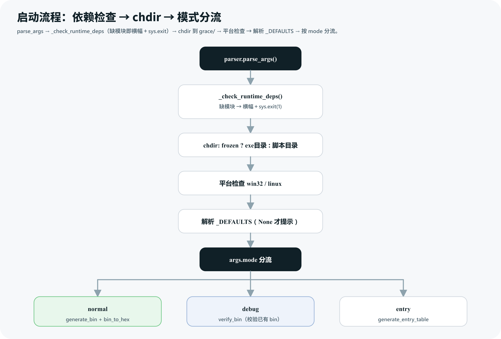
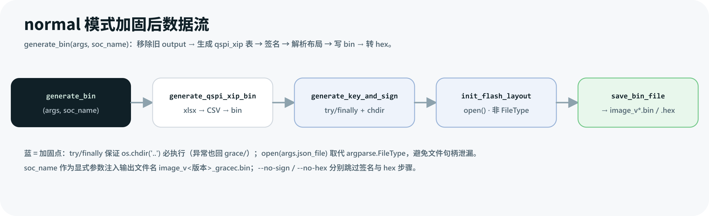
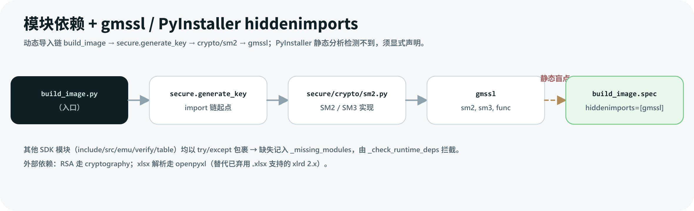

---
type: topic
title: "image_tool AddDefault_value 分支设计"
created: 2026-06-29
updated: 2026-06-30
tags:
  - image-tool
  - design
  - AddDefault_value
  - firmware-image
  - pyinstaller
status: active
---

# image_tool `AddDefault_value` 分支设计

> 本页是 GitLab 分支 `fw/image_tool` `zss/AddDefault_value` 的**技术设计文档**，记录“做了什么 + 为什么这么设计”。范围覆盖该分支已提交的两个 commit（`main cc1a244 → 756adeb`），并附本地工作区未提交的一组重构。
> 配套阅读：[[image_tool 固件镜像打包工具]]（hub）、`architecture.md`（架构/数据流，Mermaid）、`README.md`（用法）。

## 1. 背景与动机

`image_tool` 是面向 AIGCIC grace SoC 的固件镜像打包工具，将各分区 `.bin` 按 Flash 布局打包，支持 RSA/SM2 签名 + CRC-16/CRC-32 校验，产出 `.bin` / `.hex`。改造前（`main`）在日常使用与交付中暴露出若干痛点：

| 痛点 | 现象 | 影响 |
|---|---|---|
| 交互无默认值 | 4 个参数（mode/key/crc/version）每次都要手敲 | 高频重复输入，易错；交付给烧录同学门槛高 |
| 提示逻辑分散 | mode 在平台检查前提示；key/crc/version 在 `normal` 分支内由 `check_arguments` 提示；`entry` 分支又单独提示 crc | 提示顺序与位置不一致，难维护 |
| 缺 SDK 模块即崩 | 顶部裸 `import`，缺任一运行时模块直接抛 `ImportError` 堆栈 | 用户看不懂 traceback，排查成本高 |
| `-j` 用 `argparse.FileType` | 文件句柄由 argparse 持有，生命周期不受控 | 隐患；与 PyInstaller 冻结态偶有摩擦 |
| 需手动 `cd grace/` | 无工作目录自动切换 | 双击或任意目录运行即失败 |
| `generate_key_and_sign` 异常不回退 | `os.chdir('secure')` 后 `os.chdir('..')` 不在 `finally` 中 | 签名失败后 cwd 残留在 `secure/`，后续步骤路径错乱 |
| 缺架构文档 | 无 `architecture.md`，仅有 README | 新人无整体地图；改动易跑偏 |
| PyInstaller 漏 `gmssl` | `gmssl` 经动态导入链加载，静态分析检测不到 | 编译版运行报 `ModuleNotFoundError: No module named 'gmssl'` |
| `excel2csv` 用 `xlrd` 2.x | `xlrd` 2.x 已弃用 `.xlsx` 支持 | normal 模式报 `Excel xlsx file; not supported` |
| 退出提示不分平台 | `if sys.platform != 'linux': input(...)` | 脚本/CI 调用时被“按回车退出”阻塞 |

分支目标：在**保持打包行为不变**的前提下，提升交互体验、健壮性与可维护性，并补齐文档与打包配置。

## 2. 设计目标

1. **默认值化**：4 个交互参数都有合理默认值，回车即用；CLI 显式传入的参数不再提示。
2. **提示集中化**：所有参数解析在分流前一次完成，提示函数自解释、可复用。
3. **启动自检**：缺运行时模块时给出明确中文提示与期望目录结构，而非裸 traceback。
4. **健壮性**：自动 `chdir` 到 `grace/`；`generate_key_and_sign` 用 `try/finally` 保证目录回退；`-j` 改用普通字符串 + `open`。
5. **平台化退出**：仅 Windows 暂停等回车，Linux 直接退出，利于脚本/CI。
6. **文档与打包**：新增 `architecture.md`（Mermaid）、重写 README、新增 `build_image.spec`（声明 `gmssl` hiddenimports）、`excel2csv` 改 `openpyxl`。

## 3. 总体方案与改动总览

分支共 2 个提交（`e90a75f` + `756adeb`），改动 7 个文件：

| 文件 | 改动量 | 类别 | 说明 |
|---|---|---|---|
| `grace/build_image.py` | 257 行 ± | **核心** | 默认值机制、`_check_runtime_deps`、`try/finally`、`chdir`、`-j` 去 FileType、显式 `soc_name` 传参、平台化退出 |
| `architecture.md` | +337（新增）| 文档 | 系统总览/数据流/模块依赖/模式选择/构建/直改工作流（Mermaid） |
| `README.md` | +314 | 文档 | 5→4 提示订正、移除板型、移除废弃同步脚本、新直改工作流 |
| `grace/build_image.spec` | +60（新增）| 打包 | `hiddenimports=['gmssl','gmssl.sm2','gmssl.sm3','gmssl.func']` |
| `grace/table/excel2csv.py` | 127 行 ± | 修复 | `xlrd` → `openpyxl`；`convert_str()` 接受原生类型 |
| `release/build_exe.py` | 50 行 ± | 打包 | 改走 spec 文件并检查返回码 |
| `grace/build_image` | 二进制 | 产物 | 重编；体积 7 MB → 30 MB（`gmssl` hiddenimports 膨胀） |

> 关键事实：`soc_name = 'gracec'` 在 `main` 即已硬编码（diff 中为未改动的上下文行）。分支并未“从代码里移除板型提示”，而是把 `generate_bin(args)` 改为 `generate_bin(args, soc_name)` 显式传参，并订正 README 中“5 提示”为“4 提示”。

## 4. 核心设计详解

### 4.1 默认值机制（AddDefault_value 命名来源）

**before（main）**：`-k/-c/--fw-version/-m` 无 default；由 `check_arguments()` + 通用 `get_argument_value()` 提示，提示**不显示默认值、不支持回车接受**；`get_firmware_vesion()`（拼写错误）。提示散落在平台检查前（mode）与 `normal` 分支内（key/crc/version），`entry` 分支又单独提示 crc。

**after（分支）**：
- argparse 显式 `default=None`（`-k/-c/--fw-version/-m`），以便区分“用户 CLI 传了”与“没传”。
- `_DEFAULTS = dict(mode='normal', key='rsa', crc_type='crc16', fw_version=10102)`。
- 分流前统一解析：仅 `args.X is None`（CLI 未传）才提示；每提示带 `[default]`，回车=默认，非法=重输。
- 拆成 4 个自解释函数 `get_mode / get_key / get_crc_type / get_firmware_version`（修了拼写）。

**图1 改造前后交互对比**：


> 图解源文件：[`interaction-before-after.svg`](../../_attachments/tools/image_tool/interaction-before-after.svg)。

**图2 默认值解析决策流**（mode/key/crc/version 通用）：


> 图解源文件：[`default-resolution-flow.svg`](../../_attachments/tools/image_tool/default-resolution-flow.svg)。

**设计理由**：`default=None` 是“是否提示”的开关——只有 `None` 表示 CLI 未传。默认值集中在 `_DEFAULTS` 一处，便于后续调整（如改默认版本号只动一处）。提示统一前置，使 `normal/debug/entry` 三个分支都不再各自处理参数。

### 4.2 运行时依赖检查 `_check_runtime_deps`

**before**：顶部裸 `from include.image import *` 等，缺模块即 `ImportError` 崩溃。

**after**：每个 import 包 `try/except ImportError`，收集进 `_missing_modules`；新增 `_check_runtime_deps()`：若列表非空，打印中文错误横幅 + 期望目录树 + `sys.exit(1)`。在 `parse_args()` 之后、`chdir` 之前调用。

**设计理由**：把“缺模块”从“看不懂的堆栈”变成“明确的修复指引”（列出缺哪些、应放哪里），显著降低交付排查成本。

### 4.3 `soc_name` 显式传参

**before**：`generate_bin(args)` 内部依赖模块级 `soc_name`。

**after**：`generate_bin(args, soc_name)` 显式参数；输出文件名 `image_v<版本>_gracec.bin`。板型不再是交互项（`main` 即已硬编码，分支仅把全局依赖改为显式参数，并在 README 订正示例）。

**设计理由**：显式参数比隐式全局更易测试与追踪；`soc_name` 是板级常量，固化在源码顶部（非交互、非 CLI）。

### 4.4 `-j` 去 `argparse.FileType`

**before**：`-j` 用 `type=argparse.FileType('r')`，`args.json_file.read()`。

**after**：普通字符串 `default='src/flash_layout.json'`，`with open(args.json_file, 'r') as f: json.load(f)`。

**设计理由**：`FileType` 让 argparse 持有文件句柄，生命周期不受控；改用字符串路径 + `with open` 后句柄即用即关，行为更可预测。

### 4.5 启动 `chdir` 与模式分流

**before**：无工作目录切换，用户须 `cd grace/`。

**after**：`parse_args` + 依赖检查后：
```python
if getattr(sys, 'frozen', False):
    os.chdir(os.path.dirname(sys.executable))   # PyInstaller 冻结态
else:
    os.chdir(os.path.dirname(os.path.abspath(__file__)))  # 脚本态
```
随后平台检查 → 解析 `_DEFAULTS` → 按 `args.mode` 分流到 `normal / debug / entry`。

**图3 启动流程：依赖检查 → chdir → 模式分流**：



> 图解源文件：[`startup-deps-chdir-dispatch.svg`](../../_attachments/tools/image_tool/startup-deps-chdir-dispatch.svg)。

**设计理由**：双击或任意目录运行都能正确定位 `image/`、`src/`、`secure/` 等相对路径；冻结态与脚本态分别用 `sys.executable` / `__file__` 定位。

### 4.6 `generate_key_and_sign` 的 `try/finally`

**before**：`os.chdir('secure') … os.chdir('..')`，中间抛异常则不回退。

**after**：
```python
def generate_key_and_sign(key):
    os.chdir('secure')
    try:
        ...  # 生成密钥 + 签名
    finally:
        os.chdir('..')   # 异常也保证回 grace/
```

**图4 normal 模式加固后数据流**（高亮 `try/finally` 与 `open` 两个加固点）：



> 图解源文件：[`normal-mode-dataflow-hardened.svg`](../../_attachments/tools/image_tool/normal-mode-dataflow-hardened.svg)。

**设计理由**：签名失败后若 cwd 残留在 `secure/`，后续 `init_flash_layout`、`save_bin_file` 的相对路径会全错；`finally` 是这一保证的关键，**勿删**。

### 4.7 entry 模式与平台化退出

**before**：`entry` 分支单独 `if not args.crc_type: get_argument_value(...)`；退出 `if sys.platform != 'linux': input(...)`。

**after**：crc 在分流前已默认解析，`entry` 直接 `generate_entry_table(args)` 并包 `try/except`；退出改为 `if sys.platform == 'win32': input(...)`（仅 Windows 暂停，Linux 直接退出，利于脚本/CI）。

### 4.8 配套：文档、打包与依赖

- **`architecture.md`（新增）**：含 Mermaid 图——系统总览、数据流、模块依赖、模式选择、构建流程、直改工作流。
- **`README.md`（重写）**：移除 `build_image_new.py` / `_apply_changes.py` 废弃同步脚本描述；移除板型参数；交互示例 5 提示 → 4 提示；用“服务器直接编辑”工作流替代旧“三文件同步”。
- **`build_image.spec`（新增）**：声明 `hiddenimports=['gmssl','gmssl.sm2','gmssl.sm3','gmssl.func']`。
- **`excel2csv.py`**：`xlrd` → `openpyxl`；`convert_str()` 接受 Python 原生类型。
- **`release/build_exe.py`**：改走 spec 文件并检查返回码。

#### 为什么 `convert_str()` 要跟着改

这不是单独的功能扩展，而是 `xlrd` 迁移到 `openpyxl` 后必须做的配套改动：

- 旧实现接收的是 `xlrd` 的 cell 对象，通过 `cell.ctype` 判断 empty/string/number/date，再取 `cell.value`。
- 新实现读取 `openpyxl` 的 `cell.value`，传入的是 Python 原生值：`None`、`bool`、`int`、`float`、`datetime`、`str` 等，因此只能按 `isinstance()` 判断类型。
- 根因是 `xlrd` 2.x 已经不支持 `.xlsx`，而 `image_tool` 的表格输入是 `*.xlsx`，所以必须切到 `openpyxl`。
- `bool` 分支要放在 `int` 前面，因为 Python 中 `bool` 是 `int` 的子类；否则 `True/False` 会被整数分支吞掉。
- 数值与日期行为保持旧逻辑：`1.0` 仍输出为 `"1"`，非整数浮点保留小数，日期仍格式化为 `YYYY/MM/DD HH:MM:SS`。
- 兜底 `return str(value)` 保证写入 CSV 的内容稳定为字符串，避免旧版 `return cell.value` 把非字符串对象直接交给 `csv.writer`。

**图5 模块依赖 + gmssl / PyInstaller hiddenimports**：



> 图解源文件：[`module-deps-gmssl-pyinstaller.svg`](../../_attachments/tools/image_tool/module-deps-gmssl-pyinstaller.svg)。

**设计理由**：`gmssl` 经 `secure.generate_key → crypto/sm2 → from gmssl import sm2, sm3, func` 动态导入，PyInstaller 静态分析检测不到，故必须在 spec 中显式声明。

## 5. 未提交工作区重构（行为不变，质量演进）

本地 `grace/build_image.py` 在分支两个 commit 之上还叠加了一组**未提交**重构，消除重复、提升可读性：

| 项 | before（分支 756adeb） | after（本地工作区） |
|---|---|---|
| 提示函数 | `get_mode/get_key/get_crc_type` 各自一段近似重复的 `while` 循环 | 抽出共享 `_prompt_choice(label, choices, default)`，三者改为调用它 |
| 默认值表 | `_DEFAULTS = dict(...)` + 4 个独立 `if args.X is None:` | `_DEFAULTS` 元组列表 `[('mode', get_mode, 'normal'), ...]` + `for attr, getter, default in _DEFAULTS:` 循环 |
| 版本字符串 | 版本打印与输出文件名各写一遍 `{}.{}.{}` 格式化 | 抽出 `_fw_version_str(v)`，两处复用 |
| 依赖目录树 | `_check_runtime_deps` 内联 `print` 一大段目录树 | 提取为模块级常量 `_DIR_TREE` |

> 这些重构**不改变行为**（仍是 4 提示、回车=默认、非法重输），仅是 DRY/可维护性改进。设计文档以已提交 diff 为主线，本节为补充。

## 6. 影响与风险

| 项 | 影响 | 缓解 |
|---|---|---|
| 默认值固化 | `mode=normal/key=rsa/crc=crc16/version=10102` 成为默认；老脚本若依赖“无默认即报错”会行为变化 | CLI 仍可显式覆盖；默认值集中在 `_DEFAULTS` 一处 |
| `_check_runtime_deps` 早退 | 缺模块即 `sys.exit(1)`，不再进交互 | 提示明确，属预期行为 |
| `try/finally` 目录恢复 | 异常后 cwd 必回 `grace/` | 正是修复目标；`finally` 勿删 |
| PyInstaller 体积 | 7 MB → 30 MB（`gmssl` 全包） | 可接受；换正确性 |
| `soc_name` 硬编码 | 仅支持 `gracec`；换板需改源码第 68 行 | 当前单板场景可接受；多板需参数化 |

## 7. 测试与验证

```bash
# 远程（192.168.80.116），4 次回车 = 全默认：
ssh 192.168.80.116 "cd /home/shuaishuai.zhu/image_tool/grace && printf '\n\n\n\n' | python3 build_image.py"
# 预期：output/image_v1.1.2_gracec.hex 生成

# CLI 跳过对应提示：
python3 build_image.py -m normal -k rsa -c crc16 --fw-version 10102
python3 build_image.py -k sm2 -c crc32 --no-sign
python3 build_image.py -m debug            # 校验已有 bin
python3 build_image.py -m entry            # 生成 entry table

# PyInstaller（必须用 spec）：
cd grace && python3 -m PyInstaller build_image.spec && cp dist/build_image .
```

验证要点：4 提示均带 `[默认值]`、回车接受、非法重输；`normal` 产出 `.bin` + `.hex`；`debug` 校验已有 bin；`entry` 生成 entry table；编译版不报 `gmssl` 缺失。

## 8. 附录

### 8.1 提交清单

| commit | 标题 |
|---|---|
| `e90a75f` | Add default value（加默认值 / 修 Linux 脚本 / 更新 readme） |
| `756adeb` | Optimize e90a75f（修提示、更新文档、新工作流） |

diff 基线：`main cc1a244 → 756adeb`。取 diff 命令：
```bash
ssh 192.168.80.116 "cd /home/shuaishuai.zhu/image_tool && git diff cc1a244..756adeb -- grace/build_image.py"
```

### 8.2 与既有文档的关系

- 本页聚焦**分支改动的设计与理由**。
- `architecture.md`（Mermaid）描述“改造后”的架构与数据流，是整体地图。
- `README.md` 是用户用法指南。
- 三者互补：本页=“为什么改”，architecture=“改完长什么样”，README=“怎么用”。

### 8.3 图解清单

| 图 | 文件 | 主题 |
|---|---|---|
| 图1 | `interaction-before-after` | 改造前后交互提示对比 |
| 图2 | `default-resolution-flow` | 默认值解析决策流 |
| 图3 | `startup-deps-chdir-dispatch` | 启动流程：依赖检查 + chdir + 模式分流 |
| 图4 | `normal-mode-dataflow-hardened` | normal 模式加固后数据流 |
| 图5 | `module-deps-gmssl-pyinstaller` | 模块依赖 + gmssl / PyInstaller hiddenimports |

图解均位于 `_attachments/tools/image_tool/`，源文件 `.svg` + 渲染 `.png`（按 `technical-diagram-generator` 工作流产出，已过 `lint-svg-text-overlap` 校验）。
