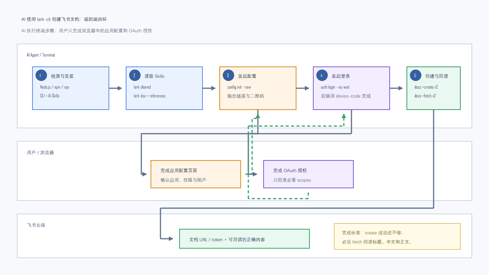

# AI 使用飞书 lark-cli 创建文档：从零安装、授权到验证

> 本页的读者是 **AI Agent**。你应自行执行终端命令、检查输出、读取 Skills、创建并回读文档；不要把可自动执行的命令甩给用户。只有浏览器中的飞书应用配置、登录和授权必须交给用户确认。

一句话心智模型：先安装 `lark-cli + AI Skills`，再让用户完成一次飞书应用配置与 OAuth 授权，最后用 `docs +create --api-version v2` 创建文档，并用 `docs +fetch` 回读验收。



> 图解源文件：[lark-cli-ai-document-flow.svg](../../_attachments/tools/lark-cli-ai/lark-cli-ai-document-flow.svg)

## 1. AI 的完成标准

只有同时满足以下条件，才可以向用户报告“飞书文档创建完成”：

1. `lark-cli` 可执行且版本命令成功。
2. `lark-shared`、`lark-doc` 等 AI Skills 已安装，并已重新启动或重新建立 AI 会话。
3. 飞书应用配置成功。
4. 选定的执行身份正确：通常创建用户自己的文档使用 `--as user`。
5. `docs +create --api-version v2` 返回 `ok: true` 和文档 URL/token。
6. 使用 `docs +fetch --api-version v2` 回读，标题和正文与预期一致。
7. 最终只向用户报告文档 URL、身份、验证结果和仍需关注的权限问题；不得泄露 App Secret、access token、device code。

## 2. 先识别运行环境

依次检查，不要先假设任何工具已经存在：

```powershell
node --version
npm --version
npx --version
```

Windows PowerShell 如果被执行策略拦截 `.ps1` 包装器，优先改用：

```powershell
node.exe --version
npm.cmd --version
npx.cmd --version
```

Linux/macOS 使用普通的 `node`、`npm`、`npx` 命令。

### 2.1 如果没有 Node.js

Node.js 是 npm 安装方式的唯一前置依赖。优先安装当前 LTS。

Windows：

```powershell
winget install OpenJS.NodeJS.LTS
```

macOS（已安装 Homebrew）：

```bash
brew install node
```

Ubuntu/Debian：

```bash
sudo apt-get update
sudo apt-get install -y nodejs npm
```

安装后必须重新打开终端，再次验证 `node`、`npm`、`npx`。不要为了安装 npm 版本而安装 Go 或 Python；它们只在从源码构建 lark-cli 时需要。

## 3. 安装 lark-cli 和 AI Skills

官方推荐的一体化安装命令：

```bash
npx @larksuite/cli@latest install
```

Windows PowerShell：

```powershell
npx.cmd @larksuite/cli@latest install
```

该安装流程应同时安装 CLI 与 Agent Skills。完成后验证：

```bash
lark-cli --version
lark-cli --help
lark-cli docs +create --help
```

Windows 优先：

```powershell
lark-cli.cmd --version
lark-cli.cmd --help
lark-cli.cmd docs +create --help
```

如果一体化安装后 Skills 缺失，补装：

```bash
npx skills add larksuite/cli -g -y
```

Windows：

```powershell
npx.cmd skills add larksuite/cli -g -y
```

补装后必须让当前 AI 客户端重新启动或新建会话。Skills 通常在会话启动时加载；在旧会话中继续执行，可能仍然看不到 `lark-doc`。

## 4. AI 必须先读取已安装 Skills

不要仅凭记忆拼命令。每次创建飞书文档前：

1. 找到并完整读取 `lark-shared/SKILL.md`。
2. 找到并完整读取 `lark-doc/SKILL.md`。
3. 按 `lark-doc` 的要求继续读取创建文档所需的 references，至少包括创建命令、内容格式和样式规则。
4. 再运行一次 `lark-cli docs +create --help`。

Skills 的安装位置因 AI 工具和操作系统而异，常见目录包括：

```text
~/.agents/skills/lark-shared/
~/.agents/skills/lark-doc/
~/.claude/skills/
~/.codex/skills/
```

不要硬编码某一台机器的绝对路径。应搜索 `lark-doc/SKILL.md` 和 `lark-shared/SKILL.md`。

### 4.1 版本漂移处理

官方 `main` 当前要求文档命令使用 v2：

```text
docs +create --api-version v2
docs +fetch  --api-version v2
docs +update --api-version v2
```

如果本机 `docs +create --help` 仍只显示旧参数（例如 `--markdown`、`--title`），说明 CLI 与 Skills 版本不一致。不要混用新旧参数，先更新：

```bash
npm update -g @larksuite/cli
npx skills add larksuite/cli -g -y
```

Windows：

```powershell
npm.cmd update -g @larksuite/cli
npx.cmd skills add larksuite/cli -g -y
```

更新后重启 AI 会话，再读取 Skills 和 `--help`。

## 5. 首次配置飞书应用

如果对方环境完全没有配置，优先让 CLI 创建并引导配置应用：

```bash
lark-cli config init --new
```

Windows：

```powershell
lark-cli.cmd config init --new
```

### 5.1 AI 的执行规则

此命令可能阻塞等待用户在浏览器中完成配置。AI 应：

1. 在支持后台任务的执行环境中启动命令。
2. 从结构化输出提取 `verification_url`、`verification_uri_complete` 或 `console_url`。
3. 将 URL 原样提供给用户，不得改写、编码或拼接。
4. 根据已安装 `lark-shared` 的要求生成二维码，并同时提供链接：

```bash
lark-cli auth qrcode "<VERIFICATION_URL>" --output "feishu-config-qrcode.png"
```

5. 明确要求用户完成页面操作后回来确认。
6. 用户确认后，AI 检查后台命令是否成功退出。

### 5.2 已有 App ID / App Secret

只有用户明确要求复用现有应用时，才使用非交互配置：

```bash
lark-cli config init --app-id "<APP_ID>" --app-secret-stdin --brand feishu
```

App Secret 必须从 stdin、安全输入或密钥管理器提供。禁止：

- 把 Secret 写进 wiki、代码、命令历史、日志或聊天回复。
- 使用会让 Secret 出现在进程列表中的普通命令参数。
- 打印配置文件或 token 进行“验证”。

需要多个应用时使用命名 profile，并在后续命令显式传 `--profile`，不要静默覆盖默认 profile：

```bash
lark-cli config init --name "<PROFILE_NAME>" --app-id "<APP_ID>" --app-secret-stdin --brand feishu
lark-cli --profile "<PROFILE_NAME>" auth status
```

## 6. 登录与授权

创建用户自己可见、可管理的文档，通常使用 user 身份：

```bash
lark-cli auth login --recommend
```

### 6.1 推荐给 AI 的 split-flow

如果 AI 工具不能持续向用户展示后台输出，使用非阻塞流程：

```bash
lark-cli auth login --domain docs,drive --no-wait --json
```

AI 必须从 JSON 中提取新的 `verification_url` 和 `device_code`，生成二维码，并把 URL 与二维码交给用户。用户回复“已授权”后，AI 自己执行：

```bash
lark-cli auth login --device-code "<DEVICE_CODE>"
```

然后验证：

```bash
lark-cli auth status
lark-cli auth check --scope "<REQUIRED_SCOPE>"
```

不要缓存或复用旧的授权 URL/device code；过期后必须重新发起。

### 6.2 user 与 bot 的边界

| 身份 | 适用场景 | 关键限制 |
|---|---|---|
| `--as user` | 创建用户自己的文档、访问用户云空间 | 需要用户 OAuth；后台 scope 和用户授权都必须满足 |
| `--as bot` | 以应用身份创建或管理应用资源 | 看不到用户个人云空间；文档归属 bot，权限处理更复杂 |

没有明确理由时，创建普通飞书文档默认使用：

```text
--as user
```

权限报错时读取返回中的 `permission_violations`、`console_url` 和 `hint`：

- user 缺权限：用 `auth login --scope "<missing_scope>"` 增量授权。
- bot 缺权限：把 `console_url` 原样交给用户去开发者后台开通；不要对 bot 执行 `auth login`。

## 7. 准备文档内容

创建较长文档时，优先把内容写入本地 UTF-8 Markdown 文件，再通过 `@relative-path` 传入。这样可避免 PowerShell/Bash 对 `$`、反引号、反斜杠、引号和换行的二次解析。

示例 `feishu-document.md`：

```markdown
# 示例文档

## 目标

- 验证 AI 已能通过 lark-cli 创建飞书文档。
- 验证中文、列表和代码块能正确回读。

## 命令

`lark-cli docs +fetch --api-version v2`
```

约束：

- 文件使用 UTF-8，建议无 BOM。
- Markdown 开头只有一个一级标题，作为飞书文档标题。
- 正文从二级标题开始。
- 文本中的 Markdown 特殊字符按已安装 `lark-doc` reference 转义。
- 不要把凭证写入文档。

## 8. 创建飞书文档

先进入 Markdown 文件所在目录，并使用相对路径：

```powershell
Set-Location "<DOCUMENT_DIRECTORY>"
lark-cli.cmd docs +create `
  --api-version v2 `
  --as user `
  --doc-format markdown `
  --content "@.\feishu-document.md"
```

Linux/macOS：

```bash
cd "<DOCUMENT_DIRECTORY>"
lark-cli docs +create \
  --api-version v2 \
  --as user \
  --doc-format markdown \
  --content "@./feishu-document.md"
```

如果需要创建到个人知识库：

```bash
lark-cli docs +create \
  --api-version v2 \
  --as user \
  --parent-position my_library \
  --doc-format markdown \
  --content "@./feishu-document.md"
```

如果需要指定文件夹或 Wiki 节点，先使用 `drive +search` / `drive +inspect` / `wiki` 相关 Skill 确认 token 类型，再按当前 `docs +create --help` 和 `lark-doc` reference 选择参数。不要猜 token，也不要把文档创建到未经确认的位置。

### 8.1 XML 还是 Markdown

- 用户提供 `.md` 或明确要求导入 Markdown：使用 `--doc-format markdown`。
- 从零创作并需要 callout、grid、checkbox、whiteboard 等富块：按 `lark-doc` Skill 使用 XML。
- 不要自行把用户提供的 Markdown 重写成 XML。
- 不要复制旧版博客中的 `--markdown`/`--title` 命令去调用新版 v2。

## 9. 解析创建结果

成功输出应包含：

```json
{
  "ok": true,
  "identity": "user",
  "data": {
    "document": {
      "document_id": "doxcn...",
      "url": "https://...feishu.cn/docx/..."
    }
  }
}
```

AI 应保存：

- `identity`
- `document_id` 或文档 token
- `url`

不要把整个 JSON 原样转发给用户，因为输出可能包含不必要的内部字段或更新提示。

## 10. 回读验证

创建成功不代表内容正确。必须回读：

```bash
lark-cli docs +fetch \
  --api-version v2 \
  --as user \
  --doc "<DOCUMENT_URL_OR_TOKEN>" \
  --doc-format markdown
```

按当前 `lark-doc` Skill 的 fetch reference 选择 `--detail` / `--scope`。至少检查：

1. 标题正确。
2. 中文没有变成连续问号或乱码。
3. 列表、代码块和链接仍存在。
4. 执行身份与创建时一致。
5. 返回内容不是空文档。

如果创建的是长文档，抽查首段、一个中间章节和最后一节；不要只看 `ok: true`。

## 11. AI 应执行的完整伪代码

```text
detect node/npm/npx
if missing:
    install Node.js LTS

run latest lark-cli installer
verify lark-cli version/help
verify lark-shared and lark-doc skills exist
restart/new AI session if skills were just installed

read lark-shared/SKILL.md
read lark-doc/SKILL.md and required references
compare docs +create --help with skill syntax
if mismatch:
    update CLI and skills
    restart session and reread

if no app profile:
    start config init --new
    send exact verification URL + QR code to user
    wait for user confirmation

if no user authorization:
    start auth login split-flow
    send exact verification URL + QR code to user
    after confirmation, finish with --device-code

prepare UTF-8 Markdown/XML source
run docs +create --api-version v2 --as user
extract document URL/token
run docs +fetch --api-version v2
compare returned title/body with source
report URL + verified result
```

## 12. 常见失败与处理

| 症状 | 原因 | AI 的处理 |
|---|---|---|
| PowerShell 报脚本执行策略错误 | 命中了 `npm.ps1` / `lark-cli.ps1` | 改用 `npm.cmd`、`npx.cmd`、`lark-cli.cmd` |
| `unknown flag: --content` 或 `--doc-format` | CLI 旧、Skills 新，或反过来 | 更新 CLI 和 Skills，重启会话，重新读 `--help` |
| `@C:\...` 被拒绝 | 文件参数对绝对 `@path` 兼容性差 | `cd` 到文件目录，使用 `@.\file.md` |
| 中文标题或正文异常 | 文件编码、BOM 或 shell 转义污染 | 用 UTF-8 文件传参，回读检查中文 |
| `permission denied` | 应用后台 scope 或用户 OAuth scope 缺失 | 读取 `permission_violations`；user 增量授权，bot 打开 `console_url` |
| bot 创建成功但用户看不到/不能管理 | 身份选择错误或自动授权失败 | 优先改用 user；若必须 bot，检查 `permission_grant`，未经确认不要转移 owner |
| 命令一直等待 | 正在等待浏览器配置/授权 | 后台运行或使用 `--no-wait --json` split-flow |
| AI 安装后仍说没有 lark-doc | 当前会话未重新加载 Skills | 重启 AI 客户端或新建会话 |
| 返回 `_notice.update` | 有新版 CLI/Skills | 完成当前任务后提示并更新 CLI 与 Skills |

## 13. 安全底线

1. 禁止在聊天、wiki、代码、日志中输出 App Secret、access token、refresh token。
2. 授权 URL 必须原样转发，不得修改。
3. 最小权限：只申请创建/读取文档所需域或 scope。
4. 高风险写操作如果要求确认，不得静默追加 `--yes`。
5. 不要擅自转移文档 owner、扩大共享范围或把私人机器人拉入群聊。
6. 执行前确认目标 profile、身份和父目录；执行后必须回读。

## 14. 最终回复模板

AI 完成后应简洁回复：

```text
飞书文档已创建并回读验证：
- URL：<DOCUMENT_URL>
- 身份：user
- 验证：标题、中文正文、列表和代码块均已回读确认
- 位置：<个人云空间/目标文件夹/知识库>
```

如果未完成，不要模糊地说“基本配置好了”；明确指出停在哪一步、缺哪个 scope、需要用户完成哪个浏览器动作。

## 15. 官方来源

- [larksuite/cli 中文 README](https://github.com/larksuite/cli/blob/main/README.zh.md)
- [lark-doc Skill](https://github.com/larksuite/cli/tree/main/skills/lark-doc)
- [docs +create reference](https://github.com/larksuite/cli/blob/main/skills/lark-doc/references/lark-doc-create.md)
- [Markdown format reference](https://github.com/larksuite/cli/blob/main/skills/lark-doc/references/lark-doc-md.md)
- [lark-shared Skill](https://github.com/larksuite/cli/blob/main/skills/lark-shared/SKILL.md)
